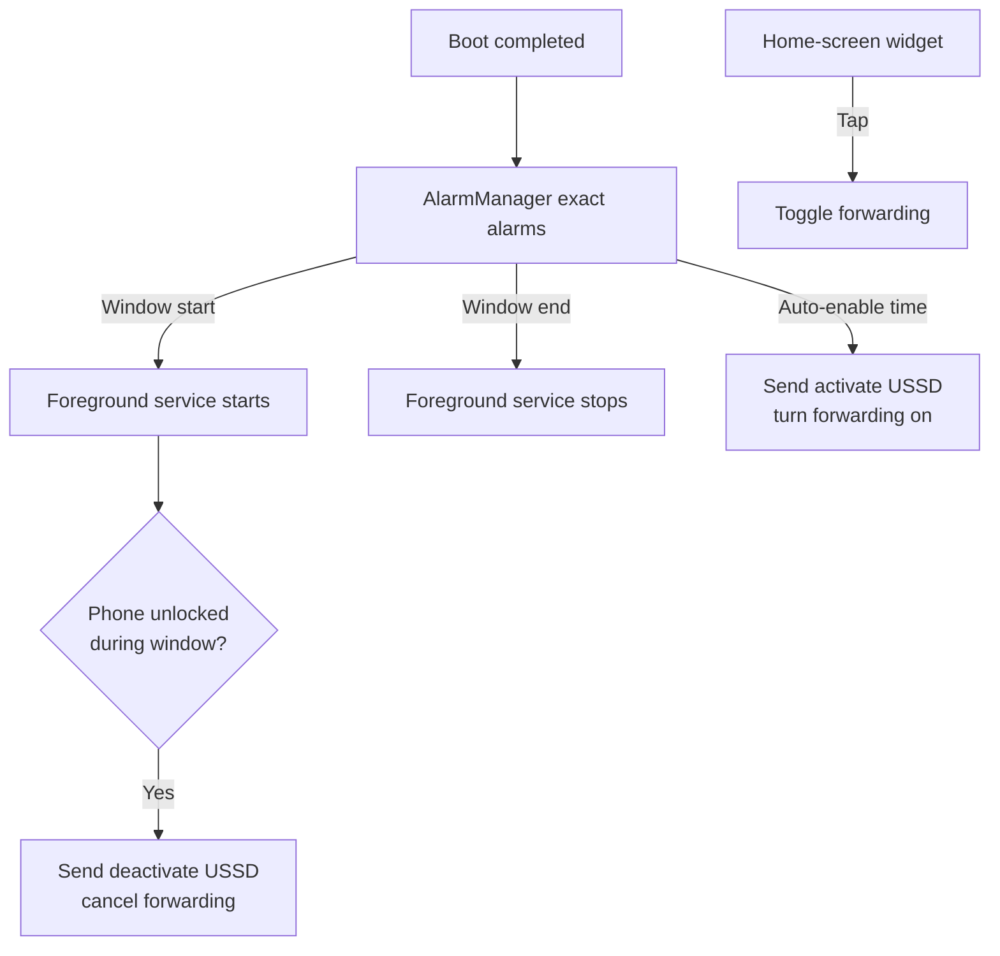

# Divert — Automatic Call Forwarding for Android

> **Never forget to turn off call forwarding again.** Divert is a tiny, battery‑friendly, open‑source Android app that **automatically cancels call forwarding the moment you unlock your phone** during a time window you choose — plus a one‑tap home‑screen widget and scheduled auto‑enable. Built natively in **Kotlin + Jetpack Compose**.

<p align="center">
  <em>Auto‑cancel call divert on unlock · Scheduled auto‑enable · Home‑screen widget · USSD/MMI based · No ads · No tracking · ~1 MB</em>
</p>

<p align="center">
  <a href="https://github.com/C0SMlC/divert/raw/stable/release/Divert-1.0.apk"><b>⬇️ Download the latest APK</b></a> ·
  <a href="#-installation">Install</a> ·
  <a href="#-build-from-source">Build</a> ·
  <a href="#-how-it-works">How it works</a> ·
  <a href="#-troubleshooting--reliability">Troubleshooting</a>
</p>

---

## 💡 Why Divert exists

Many workplaces don't allow smartphones on the floor, so people **forward their mobile to a desk/landline number** while at work and **cancel the forwarding when they leave**. The problem: it's easy to forget to turn it off, so personal calls keep ringing the office phone after hours.

Divert automates exactly this. Because your phone stays _outside_ the restricted area (locker, car, bag), **any unlock during work hours means you've stepped out** — so that's the perfect moment to automatically cancel forwarding. No smartphone needed on the floor, no manual steps, no forgetting.

## ✨ Features

- **🔓 Auto‑cancel on unlock** — During a window you define (default **12:00–17:00**), the first time you unlock your phone, Divert silently cancels call forwarding.
- **⏰ Scheduled auto‑enable** — Optionally turn forwarding **on** automatically at a set time on chosen weekdays (e.g. 09:30, Mon–Fri).
- **📲 Home‑screen widget** — A minimal widget shows the live ON/OFF status and toggles forwarding with one tap.
- **🛰️ Silent USSD/MMI** — Sends carrier call‑forwarding codes via `TelephonyManager.sendUssdRequest` — **no dialer screen, no call UI**.
- **📶 Dual‑SIM aware** — Pick which SIM/subscription sends the codes.
- **🩺 Built‑in diagnostics** — An in‑app activity log plus one‑tap buttons to grant the reliability permissions Android needs.
- **🔋 Battery‑friendly by design** — Event‑driven with exact alarms; **no always‑on background service** outside your window.
- **🎨 Sleek, modern UI** — Dark theme, single mint accent, Material 3, built with Jetpack Compose.
- **🛡️ Private & offline** — No internet permission, no analytics, no accounts. Everything stays on your device.

## 📦 Installation

### Option A — Sideload the prebuilt APK (easiest)

1. **[Download `Divert-1.0.apk`](https://github.com/C0SMlC/divert/raw/stable/release/Divert-1.0.apk)** (≈1.1 MB).
2. Open the file on your Android phone and allow **Install unknown apps** for your browser/file manager when prompted.
3. Launch **Divert** and grant the **Phone** permission (needed to send forwarding codes).
4. For reliable automation, open the **Reliability & activity** card and grant **Alarms & reminders** and **Battery unrestricted** (see [Troubleshooting](#-troubleshooting--reliability)).

> The release APK is signed with a debug key for easy personal sideloading. Android 8.0 (API 26) or newer is required.

### Option B — Build it yourself

See [Build from source](#-build-from-source).

## ⚙️ Setup & configuration

1. **Forwarding number** — Enter the landline/desk number calls should divert to.
2. **Auto‑cancel window** — Set the `From`/`To` times that bound when unlocking cancels forwarding.
3. **Auto‑enable (optional)** — Toggle it on, pick a time and weekdays to switch forwarding on automatically.
4. **SIM** — On dual‑SIM phones, choose the subscription that should send the codes.
5. **Carrier codes (Advanced)** — The USSD/MMI strings are fully editable so **any carrier** works.

### Carrier USSD/MMI codes

Divert ships with standard GSM / **Jio (India)** defaults. Edit them under **Advanced** for your operator:

| Action                     | Default code    | Notes                                              |
| -------------------------- | --------------- | -------------------------------------------------- |
| Activate (unconditional)   | `*21*{number}#` | `{number}` is replaced with your forwarding number |
| Deactivate / erase         | `##21#`         | Turns forwarding off                               |
| Check status (interrogate) | `*#21#`         | Queries the carrier's current state                |

> Most GSM carriers use these standard MMI codes. If yours differs, just paste the correct strings into the Advanced section.

## 🧠 How it works

Divert is **event‑driven** to keep battery use negligible:



- **`AlarmScheduler`** registers exact, Doze‑friendly alarms for the window start/end and the optional auto‑enable. Each alarm reschedules its own next occurrence — at most three pending alarms at any time.
- **`UnlockListenerService`** is a lightweight foreground service that runs **only during the window**. It listens for `ACTION_USER_PRESENT` (and `ACTION_SCREEN_ON` + keyguard check, for phones without a secure lock) and cancels forwarding on the first unlock.
- **`ForwardingController`** sends the MMI/USSD codes silently and keeps the locally tracked ON/OFF state in sync.
- **`DivertWidget`** is a `RemoteViews` app widget (lighter than Glance) for at‑a‑glance status and one‑tap toggling.
- **`BootReceiver`** reschedules everything after a reboot.
- **`EventLog`** records a small ring buffer of timestamped events surfaced in the app for transparency and debugging.

## 🔐 Permissions & why they're needed

| Permission                                              | Purpose                                          |
| ------------------------------------------------------- | ------------------------------------------------ |
| `CALL_PHONE`                                            | Send call‑forwarding USSD/MMI codes silently     |
| `READ_PHONE_STATE`                                      | Enumerate SIM subscriptions for the SIM selector |
| `FOREGROUND_SERVICE` / `FOREGROUND_SERVICE_SPECIAL_USE` | Run the unlock listener only during the window   |
| `POST_NOTIFICATIONS`                                    | Show the minimal “watching” status notification  |
| `RECEIVE_BOOT_COMPLETED`                                | Re‑arm alarms after a reboot                     |
| `SCHEDULE_EXACT_ALARM` / `USE_EXACT_ALARM`              | Fire the window/auto‑enable alarms on time       |
| `REQUEST_IGNORE_BATTERY_OPTIMIZATIONS`                  | Let you exempt Divert so alarms aren't delayed   |

**No `INTERNET` permission** — Divert cannot phone home.

## 🛠️ Build from source

### Prerequisites

- **JDK 17**
- **Android SDK** (platform `android-35`, build‑tools `35.0.0`, platform‑tools)
- **Gradle 8.11.1** (or use the included wrapper)

### Steps

```bash
# Clone
git clone https://github.com/C0SMlC/divert.git
cd divert

# Point the build at your Android SDK (or set ANDROID_HOME)
echo "sdk.dir=/path/to/Android/sdk" > local.properties

# Build a release APK
./gradlew assembleRelease        # Windows: gradlew.bat assembleRelease

# Output:
# app/build/outputs/apk/release/app-release.apk
```

Then install on a connected device with `adb install -r app/build/outputs/apk/release/app-release.apk`.

## 🧩 Tech stack

- **Language:** Kotlin
- **UI:** Jetpack Compose + Material 3 (dark theme)
- **Widget:** `RemoteViews` (`AppWidgetProvider`)
- **Async scheduling:** `AlarmManager` exact alarms + `BroadcastReceiver`s
- **Telephony:** `TelephonyManager.sendUssdRequest`
- **Storage:** `SharedPreferences`
- **Min/Target SDK:** 26 / 35 (Android 8.0 → Android 15)
- **Build:** Android Gradle Plugin, Compose BOM `2024.12.01`, Kotlin Compose plugin

## 📁 Project structure

```
app/src/main/java/com/pratik/divert/
├─ MainActivity.kt              # Compose host; keeps automation in sync on resume
├─ DivertApp.kt                 # Application + notification channel
├─ ui/DivertScreen.kt           # Full Compose UI + diagnostics card
├─ ui/Theme.kt                  # Dark Material 3 theme
├─ data/Settings.kt             # SharedPreferences-backed settings
├─ data/EventLog.kt             # Ring-buffer activity log
├─ telephony/ForwardingController.kt  # Sends USSD codes, tracks state
├─ telephony/Telephony.kt       # SIM / subscription helpers
├─ alarm/AlarmScheduler.kt      # Exact-alarm scheduling
├─ alarm/WindowReceiver.kt      # Window start/end + auto-enable
├─ boot/BootReceiver.kt         # Reschedule after reboot
├─ service/UnlockListenerService.kt   # Unlock listener (window-only FGS)
├─ service/ServiceControl.kt    # Start/stop helper
└─ widget/DivertWidget.kt       # Home-screen widget
```

## 🩹 Troubleshooting & reliability

Android (especially aggressive OEM skins) can throttle background work. If automation doesn't fire:

1. **Grant “Alarms & reminders”** — Open Divert → **Reliability & activity** → tap **Allow**. Required so exact alarms fire on time.
2. **Set battery to “Unrestricted”** — Same card → tap **Fix**, or _Settings → Apps → Divert → Battery → Unrestricted_. Prevents the OS from delaying alarms and the unlock listener.
3. **Enable Auto‑start / Autostart** — On Xiaomi/MIUI, Oppo/Realme/ColorOS, Vivo/Funtouch, OnePlus, Samsung, etc., enable autostart for Divert so it can run after reboot.
4. **Watch the activity log** — The in‑app log shows entries like _“Unlock detected → cancelling forwarding”_ and _“Auto‑enable alarm fired”_ so you can confirm what's happening.

> No secure lock screen? Divert also treats _screen‑on while not locked_ as an unlock, so it still works on phones without a PIN/pattern.

## ❓ FAQ

**Does it make calls or open the dialer?** No. Codes are sent silently via the telephony API.

**Will it work on my carrier?** If your carrier uses standard GSM MMI codes (most do), yes. Otherwise edit the codes under **Advanced**.

**Does it need internet?** No — there's no internet permission.

**Does it drain battery?** No always‑on service; it only runs during your window and reacts to events.

**Which Android versions?** Android 8.0 (API 26) through Android 15 (API 35).

## 🔒 Privacy

Divert stores everything locally in `SharedPreferences`. It has **no internet access**, collects **no analytics**, and requires **no account**. Your forwarding number never leaves your device.

## 🤝 Contributing

Issues and pull requests are welcome. Please keep the app minimal, battery‑efficient, and dependency‑light.

## 📄 License

Released for personal and educational use.

---

<sub>**Keywords:** Android call forwarding app · automatic call divert · auto cancel call forwarding on unlock · USSD call forwarding automation · Jio call forwarding code · call forwarding widget Android · forward calls to landline automatically · Kotlin Jetpack Compose open‑source Android app · turn off call forwarding automatically · office desk phone call forwarding · scheduled call divert · dual SIM call forwarding.</sub>
